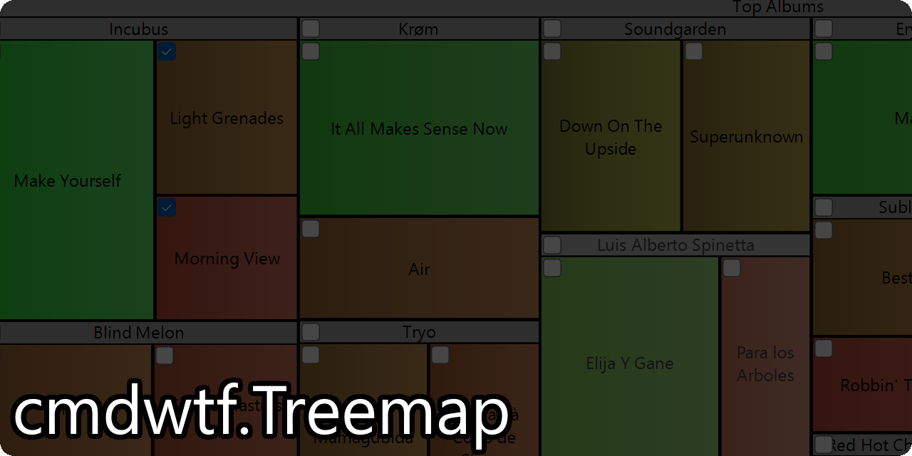

  

# 🌲🗺 cmdwtf.Treemap
A Windows Forms control that can visualize flat or hierarchical data as a [treemap](https://en.wikipedia.org/wiki/Treemapping). Designed to be an easy to use, pseudo drop-in replacement for System.Windows.Forms.TreeView.

## 🌄 Demo Video
So, what can cmdwtf.Treemap look like?

https://user-images.githubusercontent.com/602691/134817202-514e68c7-35b4-4aa3-9d1a-785bff0bb7ee.mp4

## 🔰 Project State
This is in a very 'new' state. There's bound to be tons of rough edges, bugs, or other issues. Feel free to open an issue or PR if you find anything.

## 🥅 Project Goals
- Keep API as close to System.Windows.Forms.TreeView & System.Windows.Forms.TreeNode as possible.
- Be effectively usable with minimal configuration and code.
- Provide an alternative to the commercial controls available, while still being feature rich.

## 💡 Inspiration
I've long been impressed with the ability for tools like [WinDirStat](https://windirstat.net/) to easily and effectively show off the relative sizes of files in an immediately understandable and consumable way. However, the options for Treemap controls in Windows Forms came in two flavors: Those in expensive commercial control packs, or nonexistant. Searching around and coming across libraries like [JIT](http://philogb.github.io/jit/static/v20/Jit/Examples/Treemap/example1.html) and some [helpful posts on StackOverflow](https://stackoverflow.com/a/37154938), I decided to be what I wanted to see.

The WinForms TreeView has an interface close enough to what I'd consider acceptable as an API for a Treemap. I decided to model cmdwtf.Treemap after the TreeView, trying to mimic the API as closely as possible so that cmdwtf.Treemap could be a near drop-in replacement for TreeView.

## API Differences from `TreeView`
This is not an exhaustive list of differences, but noted here are some of the larger intentional or unavoidable differences in which the `TreemapView` differs from `System.Windows.Forms.TreeView`. These are subject to change as design goals change or features are added or removed.

 - `ShowPlusMinus` is false by default, because collapsing is odd for `TreemapView`s. Though it is still somewhat supported for now.
 - `ShowLines` is marked obsolete. It has been re-routed to affect the new `ShowGrid` property, which it will warn you to use instead.
 - `LineColor` is marked obsolete. It has been re-routed to affect the new `GridColor` property, which it will warn you to use instead.
 - `FullRowSelect` is marked obsolete. It has been re-routed to affect the new `FullBranchSelect` property, which it will warn you to use instead.
   - This is a considerable departure from the behavior of `TreeView.FullRowSelect`. On the `TreeView`, this would cause the entire horizontal area from a node, extending to both sides of the control, to be selected when a node was selected. If it was false, it would just show the actual node content as selected. For `TreemapView`, this behavior is instead to show decendant nodes of a selected node as selected, so that the entire 'branch' shows as selected. This doesn't affect the underlying `SelectedNode` property, but just effects the way the control is drawn.
 - `Scrollable` is unsupported, and will always return `false`. A `TreemapView` doesn't make sense to scroll like a `TreeView` does.
   - If you need to have a larger than visible area `TreemapView`, you should be able to place it on a scrollable parent.
 - `ItemHeight` is unsupported, and will always return `0`. Since nodes in a `TreemapView` are by design not uniform, having a setting that effects their height doesn't make sense.
 - `ShowRootLines` is unsupported, and will always return `false`. A `TreemapView` doesn't have any concept of root lines.
 - The node's `FromHandle()` function isn't supported. There's no native representation of a `TreemapNode`, so there's nothing to get from a handle.
 - `TreemapNode` does not implement `ISerializable`. I just haven't had a need for this, so it hasn't got done.
 - Arrow keys do not currently navigate the view. This is on the short list of things to implement.

## 📝 License
cmdwtf.Treemap is [licensed](./LICENSE) under the AGPL 3.0 (SPDX-License-Identifier: AGPL-3.0-only). If you're interested in cmdwtf.Treemap under other terms, please contact the authors. cmdwtf.Treemap makes use of several open source packages. Those packages are each covered by their own copyrights and licenses, which are available via the tooling you use to restore the packages when building. As well, some portions of code are distributed under terms of other licenses, which are designated in comments. See `copyright` for more details.

Copyright © 2021 [Chris March Dailey](https://cmd.wtf)
This program is free software: you can redistribute it and/or modify it under the terms of the GNU Affero General Public License as published by the Free Software Foundation, version 3.

This program is distributed in the hope that it will be useful, but WITHOUT ANY WARRANTY; without even the implied warranty of MERCHANTABILITY or FITNESS FOR A PARTICULAR PURPOSE. See the GNU Affero General Public License for more details.

You should have received a copy of the GNU Affero General Public License along with this program. If not, see <https://www.gnu.org/licenses/>

### License for Example Application
The [Example](./Example) application is licensed under the MIT license. See it's [LICENSE](./Example/LICENSE) for more details.

### Licensed Software
cmdwtf.Treemap makes use of several licensed portions of code, each licensed under their own terms by their authors. In particular, some of those software licenses require the following notices. The packages themselves may reference other packages, each covered by their own license.

 - Portions of the code are from or based on the work of the [.NET Foundation](https://github.com/dotnet/winforms). Those portions are marked as such in the source via comments. They are licensed under the MIT license.
  - Copyright (c) .NET Foundation and Contributors
 - NuGet package: [cmdwtf.Toolkit.WinForms](https://github.com/cmdwtf/Toolkit) — GPL-3.0-only — Copyright © 2021 Chris Marc Dailey
 - NuGet package: [Lazy.Fody](https://github.com/tom-englert/Lazy.Fody) — MIT — Copyright (c) 2018 tom-englert
 - NuGet package: [MethodDecorator.Fody](https://github.com/Fody/MethodDecorator) — MIT — Copyright (c) Contributors
 - NuGet package: [Microsoft.SourceLink.Git](https://github.com/dotnet/sourcelink) — MIT — Copyright (c) .NET Foundation and Contributors
 - Icon: [Treemap](https://thenounproject.com/term/treemap/358465/) by Sam Smith from the Noun Project

#### Acknowledgements
Sample data in the [Example](./Example) application reproduced from [JIT](http://philogb.github.io/jit/static/v20/Jit/Examples/Treemap/example1.html), under the MIT license.
 
## To Do
 - Unit Tests (!)
 - Description attributes for designer info.
 - Other Treemap algorithms besides Squarified (see also: [Strip and SliceAndDice](http://philogb.github.io/jit/static/v20/Jit/Examples/Treemap/example1.html) from JIT.)
 - Handling of the `Control.Disabled` property.
 - Editing - `TreeView` optionally lets the user edit a label. It seems less useful for a control like this, but I do want to implement it for completeness anyways.
 - Dragging - Dragging nodes to other controls is likely a desireable feature. Dragging within the treemap itself doesn't make a to of sense, I don't think.
 - Keyboard Input (Spacebar toggles check state, but arrow keys aren't implemented yet.)
 - Automatic coloring of sorts. I'd like to have at least a mode where a color scale can be specified and nodes will automatically color themselves from smallest to largest as a gradient along that scale. Or perhaps a 'by type' automatic coloring, similar to how WinDirStat colors by file type.
 - ???

## Things I Don't Love
This control isn't perfect by any means. What I've listed here are some of the things about the current implemetion's design bothers me. These aren't specific to affecting performance or anything such as that, just more akin to code architecture and behavior that I'm not completely satisfied with.

 - Rendering look. I wanted to strike a balance between something that felt WinForms native, as well as well as being powerful and customizable. I'm not quite sure that I hit the mark there yet.
 - Rendering performance. Drawing in GDI+ is a bit of a fool's erand as it is, but I definitely took a "get it workng" approach. There is likely a large amount of optimization that could be done here.
 - `TreemapRenderer` orginazation. Specifically the tight coupling to the actual `TreemapNode` drawing and layout, and how the `TreemapNode` depends on specific parts of data that get calculated during rendering (due to DPI awareness) and the sort.
   - As well, the drawing functions themselves are messy and a bit unwieldy, especially with all the local variables at the top of each.
 - Collapsing. I'm not sure it even really makes sense, but I included it because `TreeView`s collapse. Perhaps it's something that should go because it doesn't make sense at all in a Treemap.
 - `TreemapNode`'s relationship with `TreemapView`. The WinForms `TreeView` and `TreeNode` are pretty tightly coupled, so I don't have an issue with that. However, because `TreeView` is a managed interface for what is a control that lives mostly in `comctl32`, the way the managed components interact is highly dependant on allowing the windows message pump to do the lifting for them. `TreemapView` uses some of the similar concepts (see the functions that are MIT licensed from the WinForms source in `TreeView.cs`), but has to handle some of it differently due to things like `TreemapNode` being entirely managed. I'm not sure if there's a real solution to cleaning up the coupling, but it's something I'd like to explore.
 - Documentation. I did a lot of reproduction from the comments from the `TreeView` and `TreeNode` classes to try and keep them feeling the same, but there is a long way to go in order to generate truly usable documentation.
 - Naming. Several things have a mix of names that I never quite nailed down for consistancy. Such as: a node referring to itself as a branch or header. If something is called drawing or rendering. Referring to the checkbox or the `state`. These are all referring to the same bits respectively, but I missed instances where I'm still using one name or another. Sometimes because I could not decide which term to use, and other times because I failed to update them when switching names in some places (especially in comments.)

## Untested Things
Things listed here are bits that I've implemented or started to implement, but haven't fully explored the designs to see if they work in a logical or proper way. They likely have bugs.

 - `TopNode`
 - Owner Drawing
 - Node traversal (`PrevNode`, `NextNode`, etc.)
 - Collapsing
 - RightToLeft
 - Node serialization
 - Node creation/editing via designer.
